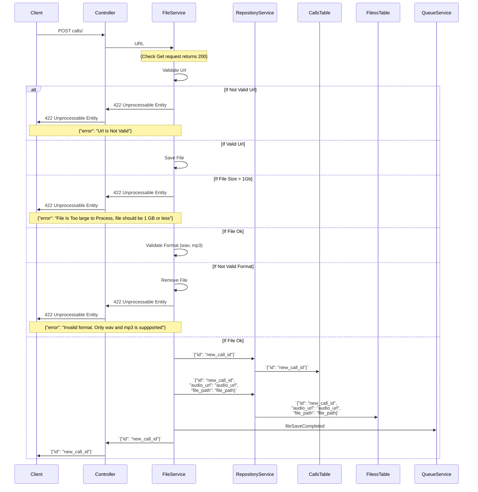
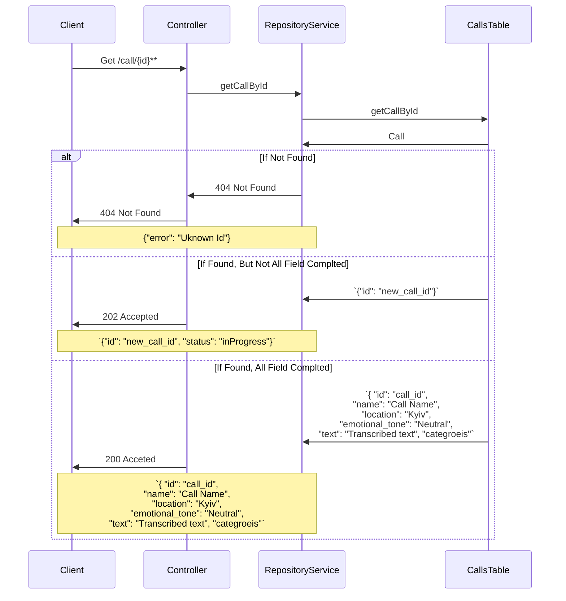

### POST /call

```mermaid
sequenceDiagram
    Client->>Controller: POST calls/
    Controller->>FileService: URL
    Note Over FileService: (Check Get request returns 200)
    FileService->>FileService: Validate Url
    alt If Not Valid Url
        FileService->>Controller: 422 Unprocessable Entity
        Controller->>Client: 422 Unprocessable Entity
        Note Over FileService, Client:  {"error": "Url Is Not Valid"}
    else If Valid Url
    FileService->>FileService: Save File
    else If File Size > 1Gb
    FileService->>Controller: 422 Unprocessable Entity
        Controller->>Client: 422 Unprocessable Entity
        Note Over FileService, Client:  {"error": "File Is Too large to Process, file should be 1 GB or less"}
    else If File Ok
        FileService->>FileService: Validate Format (wav, mp3)
    else If Not Valid Format
        FileService->>FileService: Remove File
        FileService->>Controller: 422 Unprocessable Entity
        Controller->>Client: 422 Unprocessable Entity
        Note Over FileService, Client:  {"error": "Invalid format. Only wav and mp3 is suppported"}
    else If File Ok
        FileService->>RepositoryService: `{"id": "new_call_id"}`
        RepositoryService->>CallsTable:  `{"id": "new_call_id"}`
        FileService->>RepositoryService: `{"id": "new_call_id",<br/> "audio_url": "audio_url", <br/>"file_path": "file_path}`
        RepositoryService->>FilessTable: `{"id": "new_call_id",<br/> "audio_url": "audio_url", <br/>"file_path": "file_path}`
        FileService->>QueueService: fileSaveCompleted
        FileService->>Controller: `{"id": "new_call_id"}`
        Controller->> Client: `{"id": "new_call_id"}`
    end
```

### Get /call

```mermaid
sequenceDiagram
    Client->>Controller: Get /call/{id}**
    Controller->>RepositoryService: getCallById
    RepositoryService->>CallsTable:  getCallById
    CallsTable->>RepositoryService: Call
    alt If Not Found
        RepositoryService->>Controller: 404 Not Found
        Controller->>Client: 404 Not Found
        Note Over RepositoryService, Client:  {"error": "Uknown Id"}
    else If Found, But Not All Field Complted
        CallsTable->>RepositoryService: `{"id": "new_call_id"}`
        Controller->>Client: 202 Accepted
        Note Over RepositoryService, Client:  `{"id": "new_call_id", "status": "inProgress"}`
    else If Found, All Field Complted
        CallsTable->>RepositoryService: `{ "id": "call_id",<br/> "name": "Call Name", <br/> "location": "Kyiv", <br/> "emotional_tone": "Neutral", <br/> "text": "Transcribed text", "categroeis"`
        Controller->>Client: 200 Acceted
        Note Over RepositoryService, Client:  `{ "id": "call_id",<br/> "name": "Call Name", <br/> "location": "Kyiv", <br/> "emotional_tone": "Neutral", <br/> "text": "Transcribed text", "categroeis"`
    end

```