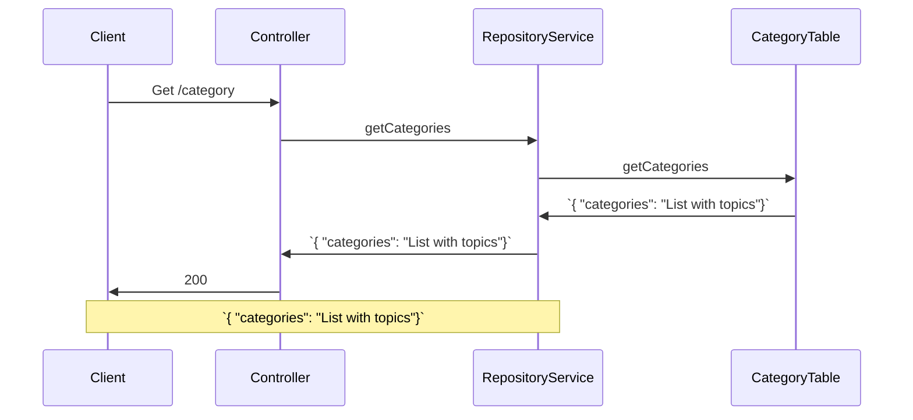
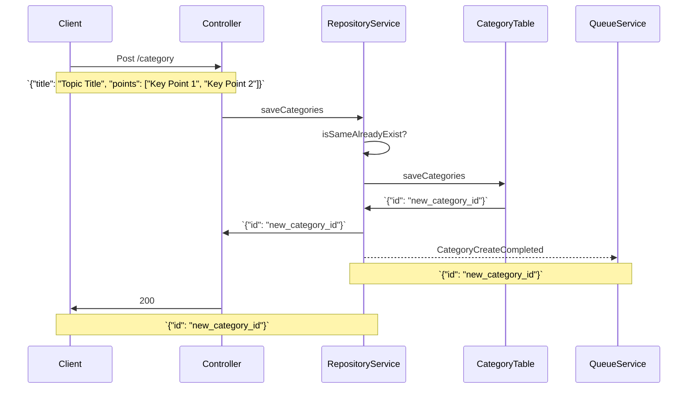
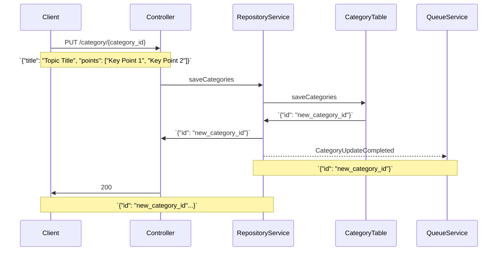

### Get /category

```mermaid
sequenceDiagram
    Client->>Controller: Get /category
    Controller->>RepositoryService: getCategories
    RepositoryService->>CategoryTable:  getCategories
    CategoryTable->>RepositoryService: `{ "categories": "List with topics"}`
    RepositoryService->>Controller: `{ "categories": "List with topics"}`
    Controller->>Client: 200
    Note Over RepositoryService, Client:  `{ "categories": "List with topics"}`
```

### Post /category

```mermaid
sequenceDiagram
    Client->>Controller: Post /category
    Note Over Client, Controller:  `{"title": "Topic Title", "points": ["Key Point 1", "Key Point 2"]}`
    Controller->>RepositoryService: saveCategories
    RepositoryService->>RepositoryService: isSameAlreadyExist?
    RepositoryService->>CategoryTable:  saveCategories
    CategoryTable->>RepositoryService: `{"id": "new_category_id"}`
    RepositoryService->>Controller: `{"id": "new_category_id"}`
    RepositoryService-->>QueueService: CategoryCreateCompleted
     Note Over RepositoryService, QueueService:  `{"id": "new_category_id"}`
    Controller->>Client: 200
    Note Over RepositoryService, Client:  `{"id": "new_category_id"}`
```

### PUT /category

```mermaid
sequenceDiagram
    Client->>Controller: PUT /category/{category_id}
    Note Over Client, Controller:  `{"title": "Topic Title", "points": ["Key Point 1", "Key Point 2"]}`
    Controller->>RepositoryService: saveCategories
    RepositoryService->>CategoryTable:  saveCategories
    CategoryTable->>RepositoryService: `{"id": "new_category_id"}`
    RepositoryService->>Controller: `{"id": "new_category_id"}`
    RepositoryService-->>QueueService: CategoryUpdateCompleted
     Note Over RepositoryService, QueueService:  `{"id": "new_category_id"}`
    Controller->>Client: 200
    Note Over RepositoryService, Client:  `{"id": "new_category_id"...}`
```