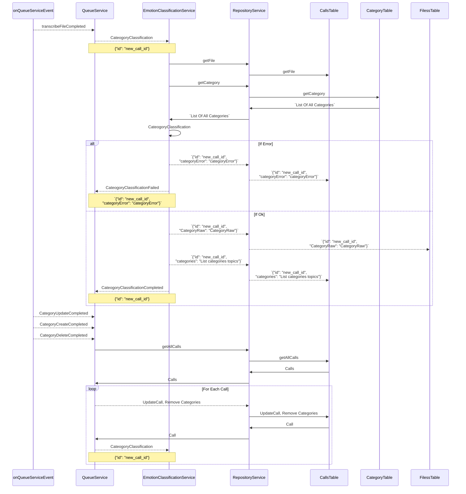

```mermaid
sequenceDiagram
    onQueueServiceEvent-->>QueueService: transcribeFileCompleted
    QueueService-->>EmotionClassificationService: CateogoryClassification
    Note Over QueueService, EmotionClassificationService:  {"id": "new_call_id"}
    EmotionClassificationService->>RepositoryService: getFile
    RepositoryService->>CallsTable: getFile
    EmotionClassificationService->>RepositoryService: getCategory
    RepositoryService->>CategoryTable: getCategory
    CategoryTable->>RepositoryService: `List Of All Categories`
    RepositoryService->>EmotionClassificationService:  `List Of All Categories`
    EmotionClassificationService->>EmotionClassificationService: CateogoryClassification
    alt If Error
        EmotionClassificationService-->>RepositoryService: `{"id": "new_call_id",<br/> "categoryError": "categoryError"}`
        RepositoryService-->>CallsTable: `{"id": "new_call_id",<br/> "categoryError": "categoryError"}`
        EmotionClassificationService-->>QueueService: CateogoryClassificationFailed
        Note Over QueueService, EmotionClassificationService:  `{"id": "new_call_id",<br/> "categoryError": "categoryError"}`
    else If Ok
        EmotionClassificationService-->>RepositoryService: `{"id": "new_call_id",<br/> "CategoryRaw": "CategoryRaw"}`
        RepositoryService-->>FilessTable: `{"id": "new_call_id",<br/> "CategoryRaw": "CategoryRaw"}`
        EmotionClassificationService-->>RepositoryService: `{"id": "new_call_id",<br/> "categories": "List categories topics"}`
        RepositoryService-->>CallsTable: `{"id": "new_call_id",<br/> "categories": "List categories topics"}`
        EmotionClassificationService-->>QueueService: CateogoryClassificationCompleted
        Note Over QueueService, EmotionClassificationService:  {"id": "new_call_id"}
    end
    onQueueServiceEvent-->>QueueService: CategoryUpdateCompleted
    onQueueServiceEvent-->>QueueService: CategoryCreateCompleted
    onQueueServiceEvent-->>QueueService: CategoryDeleteCompleted
    QueueService->>RepositoryService: getAllCalls
    RepositoryService->>CallsTable: getAllCalls
    CallsTable->>RepositoryService: Calls
    RepositoryService->>QueueService: Calls
    loop For Each Call
    QueueService-->>RepositoryService: UpdateCall, Remove Categories
    RepositoryService->>CallsTable: UpdateCall, Remove Categories
    CallsTable->>RepositoryService: Call
    RepositoryService->>QueueService: Call
    QueueService-->>EmotionClassificationService: CateogoryClassification
    Note Over QueueService, EmotionClassificationService:  {"id": "new_call_id"}
    end
```