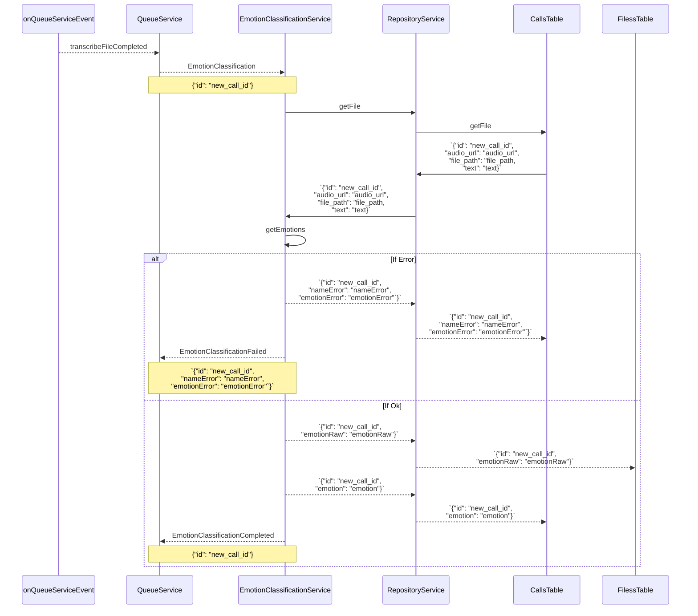

```mermaid
sequenceDiagram
    onQueueServiceEvent-->>QueueService: transcribeFileCompleted
    QueueService-->>EmotionClassificationService: EmotionClassification
    Note Over QueueService, EmotionClassificationService:  {"id": "new_call_id"}
    EmotionClassificationService->>RepositoryService: getFile
    RepositoryService->>CallsTable: getFile
    CallsTable->>RepositoryService: `{"id": "new_call_id",<br/> "audio_url": "audio_url", <br/>"file_path": "file_path,  <br/>"text": "text}`
    RepositoryService->>EmotionClassificationService: `{"id": "new_call_id",<br/> "audio_url": "audio_url", <br/>"file_path": "file_path,  <br/>"text": "text}`
    EmotionClassificationService->>EmotionClassificationService: getEmotions
    alt If Error
        EmotionClassificationService-->>RepositoryService: `{"id": "new_call_id",<br/> "nameError": "nameError", <br/> "emotionError": "emotionError"`}`
        RepositoryService-->>CallsTable: `{"id": "new_call_id",<br/> "nameError": "nameError", <br/> "emotionError": "emotionError"`}`
        EmotionClassificationService-->>QueueService: EmotionClassificationFailed
        Note Over QueueService, EmotionClassificationService:  `{"id": "new_call_id",<br/> "nameError": "nameError", <br/> "emotionError": "emotionError"`}`
    else If Ok
        EmotionClassificationService-->>RepositoryService: `{"id": "new_call_id",<br/> "emotionRaw": "emotionRaw"}`
        RepositoryService-->>FilessTable: `{"id": "new_call_id",<br/> "emotionRaw": "emotionRaw"}`
        EmotionClassificationService-->>RepositoryService: `{"id": "new_call_id",<br/> "emotion": "emotion"}`
        RepositoryService-->>CallsTable: `{"id": "new_call_id",<br/> "emotion": "emotion"}`
        EmotionClassificationService-->>QueueService: EmotionClassificationCompleted
        Note Over QueueService, EmotionClassificationService:  {"id": "new_call_id"}
    end
```