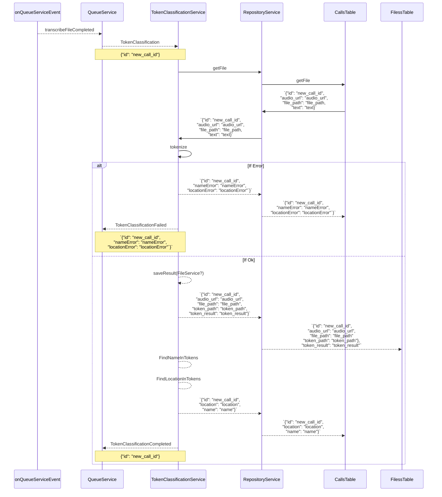

```mermaid
sequenceDiagram
    onQueueServiceEvent-->>QueueService: transcribeFileCompleted
    QueueService-->>TokenClassificationService: TokenClassification
    Note Over QueueService, TokenClassificationService:  {"id": "new_call_id"}
    TokenClassificationService->>RepositoryService: getFile
    RepositoryService->>CallsTable: getFile
    CallsTable->>RepositoryService: `{"id": "new_call_id",<br/> "audio_url": "audio_url", <br/>"file_path": "file_path,  <br/>"text": "text}`
    RepositoryService->>TokenClassificationService: `{"id": "new_call_id",<br/> "audio_url": "audio_url", <br/>"file_path": "file_path,  <br/>"text": "text}`
    TokenClassificationService->>TokenClassificationService: tokenize
    alt If Error
        TokenClassificationService-->>RepositoryService: `{"id": "new_call_id",<br/> "nameError": "nameError", <br/> "locationError": "locationError"`}`
        RepositoryService-->>CallsTable: `{"id": "new_call_id",<br/> "nameError": "nameError", <br/> "locationError": "locationError"`}`
        TokenClassificationService-->>QueueService: TokenClassificationFailed
        Note Over QueueService, TokenClassificationService:  `{"id": "new_call_id",<br/> "nameError": "nameError", <br/> "locationError": "locationError"`}`
    else If Ok
        TokenClassificationService-->>TokenClassificationService: saveResult(FileService?)
        TokenClassificationService-->>RepositoryService: `{"id": "new_call_id",<br/> "audio_url": "audio_url", <br/>"file_path": "file_path", <br/>"token_path": "token_path", <br/>"token_result": "token_result"}`
        RepositoryService-->>FilessTable: `{"id": "new_call_id",<br/> "audio_url": "audio_url", <br/>"file_path": "file_path"<br/>"token_path": "token_path"}, <br/>"token_result": "token_result"`
        TokenClassificationService-->TokenClassificationService: FindNameInTokens
        TokenClassificationService-->TokenClassificationService: FindLocationInTokens
        TokenClassificationService-->>RepositoryService: `{"id": "new_call_id",<br/> "location": "location",<br/> "name": "name"}`
        RepositoryService-->>CallsTable: `{"id": "new_call_id",<br/> "location": "location",<br/> "name": "name"}`
        TokenClassificationService-->>QueueService: TokenClassificationCompleted
        Note Over QueueService, TokenClassificationService:  {"id": "new_call_id"}
    end
```