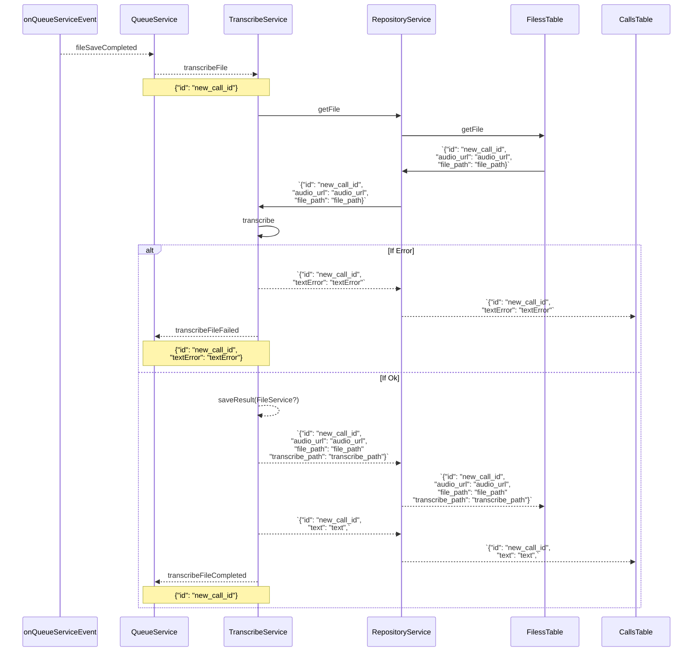

```mermaid
sequenceDiagram
    onQueueServiceEvent-->>QueueService: fileSaveCompleted
    QueueService-->>TranscribeService: transcribeFile
    Note Over QueueService, TranscribeService:  {"id": "new_call_id"}
    TranscribeService->>RepositoryService: getFile
    RepositoryService->>FilessTable: getFile
    FilessTable->>RepositoryService: `{"id": "new_call_id",<br/> "audio_url": "audio_url", <br/>"file_path": "file_path}`
    RepositoryService->>TranscribeService: `{"id": "new_call_id",<br/> "audio_url": "audio_url", <br/>"file_path": "file_path}`
    TranscribeService->>TranscribeService: transcribe
    alt If Error
        TranscribeService-->>RepositoryService: `{"id": "new_call_id",<br/> "textError": "textError"`
        RepositoryService-->>CallsTable: `{"id": "new_call_id",<br/> "textError": "textError"`
        TranscribeService-->>QueueService: transcribeFileFailed
        Note Over QueueService, TranscribeService:  {"id": "new_call_id",<br/> "textError": "textError"}
    else If Ok
        TranscribeService-->>TranscribeService: saveResult(FileService?)
        TranscribeService-->>RepositoryService: `{"id": "new_call_id",<br/> "audio_url": "audio_url", <br/>"file_path": "file_path"<br/>"transcribe_path": "transcribe_path"}`
        RepositoryService-->>FilessTable: `{"id": "new_call_id",<br/> "audio_url": "audio_url", <br/>"file_path": "file_path"<br/>"transcribe_path": "transcribe_path"}`
        TranscribeService-->>RepositoryService: `{"id": "new_call_id",<br/> "text": "text",`
        RepositoryService-->>CallsTable: `{"id": "new_call_id",<br/> "text": "text",`
        TranscribeService-->>QueueService: transcribeFileCompleted
        Note Over QueueService, TranscribeService:  {"id": "new_call_id"}
    end
```